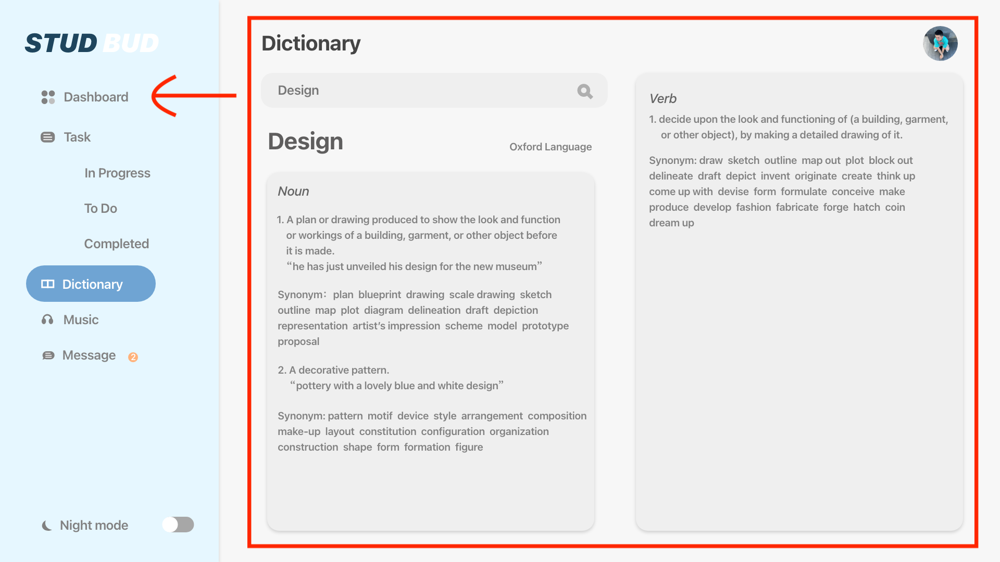

# STUDBUD
STUDBUD
 **STUDBUD**

Guanyu Chen

gche9829

**1.Introduction**

STUDBUD is a studying management software. The target audience is students who have problems managing their time and it helps students to complete their assignments more efficiently. Better task management helps students avoid turning in their assignments on the due date. It also comes with a Pomodoro timer so that students can complete their assignments more efficiently. STUDBUD includes tasks, Pomodoro timer, dictionary and music functions etc.

**2.Content**

STUDBUD contains task function: students can add as many tasks as they want, fill in the task form with the name of the task, the due date and the percentage of the weight.

Timer function: STUDBUD uses a Pomodoro, which is a very effective way of timing. Students can relax after every 25 minutes of study to help them focus better.

Additional functions: dictionary and music player. Students can look up the dictionary at will, which includes phonetic, explanations and synonyms. Students can switch to music to adjust their mood as well.

**3.**** How **** to run this application**

First of all, the first interface you open is Dashboard, and on the left side of the main interface is the catalogue, where you can click on specific pages according to user needs.

Above the main interface is the navigation bar, where users can view their login status, notifications and search bar.

Below the navigation bar is the Dashboard, and the first widget is the tasks, where users can view how many tasks they have, how many they need to complete, and how many they have completed. 

Below that is the Music widget, where users can play music directly and switch between each song. Next to that is the dictionary widget, where the user can type in a word in the search bar and click the button to get the explanation of the word. 

The second one on the left navigation bar is the task page, which users can access by clicking on it. Users can define their own tasks in the Task Add column, and then click &quot;Add&quot;, the added tasks will be displayed in the &quot;Task List&quot; on the right. Users can delete the task at will by clicking &quot;Cancel&quot;. When the user finishes the task, click &quot;Finish&quot; and the task name will turn blue to indicate that it is completed.

Below is the Pomodoro timer, when the user starts the task, they can click on the  &quot;Start&quot; button and the time will start counting down from 25 minutes. The user can click &quot;Stop&quot; to re-timer. 

**4.I**** teration**

By showing the application model for the target users and teachers, give feedback and self-reflection for further modification.

**Dashboard:**

First, the layout of the main interface was modified. It was changed from horizontal to vertical. According to the user&#39;s behavior, it is more convenient to browse vertically.

Second, the original task list was transferred to the Task page, and the dictionary function was transferred to the main interface. The purpose of doing this is to put the auxiliary   functions together, and then users can use them more easily without switching to a specific page separately. Also, users can browse how many tasks they have.

Third, the original chat function was removed. According to user feedback, students generally do not use the chat function mainly for studying. Usually students use the chat function to discuss things that are not related to their studies. And also, the chat message reminder also affects students&#39; concentration in studying. Therefore, this feature has been removed. In the future, converting the chat feature to a colloquium would be a good option. Like Slack, or posting academic content or questions would be more helpful to students.

**Task page:** 

First, I made a major change to the task interface, converting it from a block-by-block task box to a task list. The list can be more clear and concise. If there are more tasks, the original design will increase the time for users to find the tasks. Using task list can be more convenient for users to browse.

Second, remove the &quot;Add a new task&quot; button, users can add tasks directly on the page. This is more concise, users do not need to click separately.

Third, users can click directly on the Pomodoro to start count without clicking on &quot;Start&quot; in the task box. This is done because if the user completes one task and then goes to do another, the clock will reset. Pulling out the clock function separately can avoid this.

**5.Additional**

I&#39;m so sorry, Because I&#39;m still learning web coding, there may be some problems when running the program. I will try to make these features perfect.

1. The music player&#39;s audio may not play music in some systems.

2. Music progress bar may not be displayed.

3. The stop function of Pomodoro may have some problems.

**6.Reference**

packetcode. (25, April   2020). _Create Pomodoro Timer using Javascript_[Video file]. Retrieved from https://youtu.be/a7Kt7S\_4HOA

Dodo. (September 28, 2021). _How to Build a Countdown Timer in JavaScript - EASY PROJECT_ [Video file]. Retrieved from https://youtu.be/PIiMSMz7KzM

Mr About tech. (October 25, 2019). _A Dictionary App with Wordnik API using JavaScript_ [Video file]. Retrieved from https://youtu.be/qWjEUO8C3LY

Traversy Media. (April 11, 2021). _Build a Music Player | Vanilla JavaScript_ [Video file]. Retrieved from https://youtu.be/QTHRWGn\_sJw

Font Awesome. (n.d.). Font. Retrieved from https://fontawesome.com/icons/play?s=solid

Rod, D. (2022). _DECO2017 Advanced Web Design, Week 5: Tutorial Exercise Solutions._ Retrieved from https://replit.com/@robdongas/AJAX-and-APIs-Solution

Rod, D. (2022). _DECO2017 Advanced Web Design, Week 4: Tutorial Exercise Solutions._ Retrieved from https://replit.com/@GuanyuChen/InteractiveTaskList-2#index.html

Raj Gupta. (n.d.). _CodePen Home __Pomodoro Timer : : Javascript__._

Retrieved from https://codepen.io/rajdgreat007/pen/edvZpx

w3schools. (n.d.)._JavaScript __ __ Object Methods._ Retrieved from

https://www.w3schools.com/js/js\_object\_methods.asp

Free Dictionary API. (n.d.). _Get word definitions._ Retrieved from https://dictionaryapi.dev/

Borislav, H. (2021). _Change a Button&#39;s color onClick (every time) using JS ._

Retrieved from https://bobbyhadz.com/blog/javascript-change-button-color-onclick

Tyler Potts. (31 October, 2020). _Create an AWESOME Music App using JavaScript ~ A Beginners_ _Tutorial_ [Video file]. Retrieved from https://youtu.be/UCS8gYkTHpU

CodeWithHarry. (9 August, 2019). _Using a Dictionary API Exercise 5 | JavaScript Tutorial In Hindi_ _#38__._ [Video file]. Retrieved from https://youtu.be/VkBUSzawCKU

Online Tutorials. (April 7, 2021). _Responsive Admin Dashboard using Html CSS &amp; Javascript | CSS_ _Admin Template_ [Video file]. Retrieved from https://youtu.be/gdA1G5h-D80

EGATOR. (October 26, 2021). _Responsive Admin Dashboard Using HTML CSS &amp; JavaScript with_ _Light &amp; Dark Mode_ [Video file]. Retrieved from https://youtu.be/BOF79TAIkYQ

Adele.(2021). _30_ [Painting]. Retrieved from https://www.adele.com/

Adele.(2021). _30_ [CD]. Retrieved from https://www.adele.com/
